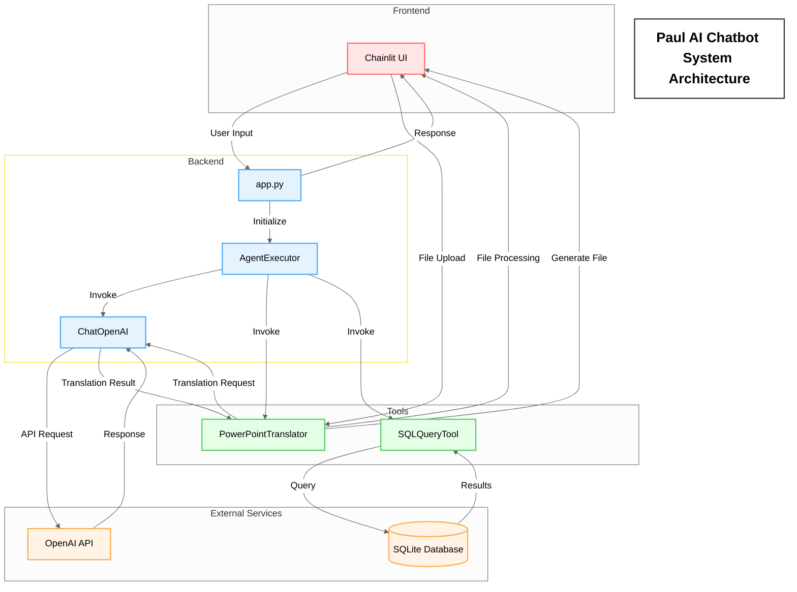

# Paul AI Chatbot System Architecture

This document describes the system architecture of the Paul AI Chatbot.

## System Architecture Diagram

## Component Description

### Frontend Layer
- **Chainlit UI**: Provides user interface, handles file uploads and displays results

### Backend Layer
- **app.py**: Main application entry point
- **AgentExecutor**: Coordinates execution between different tools and LLM
- **ChatOpenAI**: Handles communication with OpenAI API

### Tools Layer
- **PowerPointTranslator**: Handles PowerPoint file translation
- **SQLQueryTool**: Handles database queries

### External Services
- **OpenAI API**: Provides language model services
- **SQLite Database**: Stores data

## System Flow
1. User input through UI
2. `app.py` initializes AgentExecutor
3. AgentExecutor invokes appropriate tools based on request
4. Tools execute specific tasks (translation or query)
5. Results are returned to user through UI 